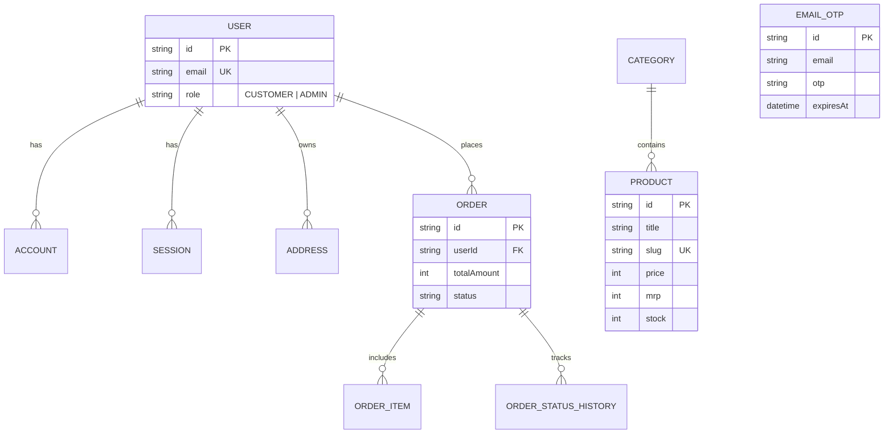

# QuickCart — System Design & Architecture Document (`DESIGN.md`)

## 1. Executive Overview & Vision

**QuickCart** is a modern, full-stack instant grocery e-commerce web application engineered for high-speed browsing, real-time inventory management, and instant order execution (inspired by 10-minute grocery delivery services like Zepto and Blinkit).

### Core Goals
- **Blazing Speed**: Sub-second UI interactions, instant search, and instant cart state updates using Zustand local persistence.
- **Dual Authentication**: Seamless sign-in via Google OAuth 2.0 or 6-digit Email OTP sent via Nodemailer SMTP.
- **Robust E-Commerce Pipeline**: Catalog browsing, category filtering, address management, atomic inventory decrement transactions, order status tracking, and an isolated Admin Operations Portal.

---

## 2. Technology Stack Architecture

```mermaid
graph TD
    Client["Next.js 15 Client (React 19 + Zustand)"]
    Auth["NextAuth.js v5 (Auth.js)"]
    API["Next.js App Router API Routes"]
    DB[("Neon PostgreSQL Serverless")]
    SMTP["Nodemailer SMTP (Gmail API)"]
    OAuth["Google OAuth 2.0"]

    Client -->|Session & Local State| Auth
    Client -->|Fetch Data & Mutate| API
    Auth -->|User Accounts & Sessions| DB
    Auth -->|Verify Google Tokens| OAuth
    API -->|Generate & Send OTP| SMTP
    API -->|Prisma Client ORM| DB
```

### Component Breakdown

| Layer | Technology | Key Responsibility |
| :--- | :--- | :--- |
| **Frontend Framework** | **Next.js 15.1 (App Router)** | Hybrid SSG/SSR rendering, file-based routing, client components |
| **UI Library** | **React 19 + Tailwind CSS** | Reactive state, responsive mobile-first UI components, glassmorphism |
| **Icons & Micro UI** | **Lucide Icons** | SVG icon set (`ShoppingBag`, `Sparkles`, `MapPin`, `Mail`, `ShieldCheck`) |
| **State Management** | **Zustand (v5)** | Persistent cart, address book, search query, and user auth synchronization |
| **Authentication** | **NextAuth.js v5 (Auth.js)** | Session handling, Prisma Adapter, JWT callbacks, role-based protection |
| **Email Service** | **Nodemailer (v8)** | SMTP email transporter sending branded HTML 6-digit OTP emails |
| **Database & ORM** | **Neon PostgreSQL + Prisma ORM (v6.19)** | Serverless relational DB, schema migrations, atomic transactions |
| **Deployment** | **Vercel Serverless Hosting** | Edge CDN distribution, automated CI/CD pipeline, environment secrets |

---

## 3. Design System & Aesthetics

QuickCart uses a custom, highly curated color palette and component tokens defined in Tailwind CSS (`tailwind.config.ts`).

### 🎨 Color Palette Tokens
- **Brand Primary**: Warm Orange (`#F97316` / `#EA580C` / `#C2410C`)
- **Brand Secondary**: Mint Green (`#10B981` / `#059669`)
- **Background Surface**: Light Off-White (`#F8FAFC`), Soft Card Slate (`#FFFFFF`)
- **Typography & Ink**: Primary Dark (`#0F172A`), Muted Gray (`#64748b`), Subtle Subtitle (`#94A3B8`)
- **Status Alerts**: Success Green (`#16A34A`), Error Red (`#DC2626`), Warning Amber (`#D97706`)

### 💫 Micro-Animations & Dynamic Feedback
- **Cart Badge Pulsing**: Bouncing total count animation on quantity increment.
- **Glassmorphism Header**: Semi-transparent backdrop blur sticky header (`backdrop-blur-md bg-white/80`).
- **Skeleton Shimmers**: High-performance content skeletons while fetching catalog items.
- **Form Interactivity**: Floating labels, focus borders (`focus-within:border-brand`), and active state feedback (`active:scale-95`).

---

## 4. Database Schema (Prisma Data Model)



### Key Models
1. **User & Auth**: `User`, `Account`, `Session`, `VerificationToken`, `EmailOtp`.
2. **Catalog & Merchandising**: `Category`, `Product`, `Banner`.
3. **Fulfillment & Logistics**: `Address`, `Order`, `OrderItem`, `OrderStatusHistory`, `ServiceablePincode`, `StoreConfig`.

---

## 5. Authentication & State Synchronization Architecture

### Dual Auth Pipeline
1. **Google OAuth 2.0**: NextAuth Google Provider with `allowDangerousEmailAccountLinking: true`.
2. **Email OTP via Nodemailer**:
   - `POST /api/auth/send-otp`: Generates 6-digit OTP, upserts `EmailOtp` record (expires in 10 mins), sends branded HTML email via Gmail SMTP (`smtp.gmail.com:465`).
   - `POST /api/auth/verify-otp` / NextAuth `signIn("email-otp")`: Validates code against DB or demo code `123456`, creates/fetches user account, and returns NextAuth session.

### Automatic Client Sync (`AuthSync`)
- NextAuth session state is synced seamlessly into the local `useAuth` Zustand store via `AuthSync` inside `components/Providers.tsx`.
- **Post-Signin Redirect**: All sign-in routes (`/login`, `/verify`) redirect directly to the **Home Page (`/`)** upon successful authentication.

---

## 6. REST API Endpoint Registry

| Route | Method | Access | Functionality |
| :--- | :--- | :--- | :--- |
| `/api/auth/[...nextauth]` | ALL | Public | Auth.js session handler (Google OAuth & Email OTP) |
| `/api/auth/send-otp` | POST | Public | Generates, saves & emails 6-digit OTP |
| `/api/auth/verify-otp` | POST | Public | Validates OTP and returns user account |
| `/api/products` | GET | Public | Search, category filter, in-stock filter, sorting |
| `/api/products/[slug]` | GET | Public | Single product details & related recommendations |
| `/api/categories` | GET | Public | Active store categories |
| `/api/banners` | GET | Public | Hero promotional banners |
| `/api/config` | GET | Public | Delivery fee, min order value & pincode checker |
| `/api/user/addresses` | GET/POST | Auth | Address book CRUD for logged-in user |
| `/api/orders` | GET/POST | Auth | Fetch user order history / Atomic order placement |
| `/api/orders/[id]` | GET | Auth | Single order detail with delivery timeline |
| `/api/orders/[id]/cancel` | POST | Auth | User order cancellation with stock restoration |
| `/api/admin/dashboard` | GET | Admin | Revenue stats, order status breakdown & low-stock alerts |
| `/api/admin/products` | GET/POST | Admin | Admin product creation & editing |
| `/api/admin/orders/[id]/status` | PATCH | Admin | State machine transitions for fulfillment status |
| `/api/admin/config` | GET/PATCH | Admin | Store configuration & pincode coverage management |

---

## 7. Production Deployment Specifications

- **GitHub Repository**: [https://github.com/raationkart-spec/eRation-Monorepo](https://github.com/raationkart-spec/eRation-Monorepo)
- **Vercel Production Domain**: [https://quickcart-nu-nine.vercel.app](https://quickcart-nu-nine.vercel.app)
- **Environment Variables**:
  - `DATABASE_URL`: Serverless Neon PostgreSQL Pool Connection.
  - `NEXTAUTH_SECRET` & `AUTH_SECRET`: Random 256-bit hash.
  - `AUTH_TRUST_HOST`: `true` (enabling Vercel dynamic hosts).
  - `GOOGLE_CLIENT_ID` & `GOOGLE_CLIENT_SECRET`: Google OAuth credentials.
  - `APP_EMAIL` & `APP_PASSWORD`: Gmail App Password SMTP credentials (`devilrngr@gmail.com`).
