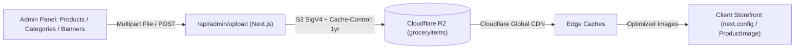

# Master Plan: Cloudflare R2 CDN Image Pipeline + Excel Bulk Import + Production-Ready Admin

## Architecture & Validated Configuration

| Layer / Feature | Specification | Implementation Details |
|---|---|---|
| **Storage & CDN** | **Cloudflare R2 + Global Edge CDN** | Account: `c7d624ee1a82d294c62275a2135719b4`, Bucket: `groceryitems`. Authenticated via `@aws-sdk/client-s3` with SigV4. |
| **CDN Caching** | **1-Year Immutable Cache** | Uploads include `CacheControl: "public, max-age=31536000, immutable"`. Cloudflare Edge caches images globally. |
| **Next.js Image Config** | **`next.config.ts` Remote Patterns** | Configured for `*.r2.dev`, `*.cloudflarestorage.com`, `*.cloudflare.com` with `minimumCacheTTL: 31536000`. |
| **Admin Image Uploads** | **Products, Categories & Banners** | R2 image upload integrated into Product forms, Category modals, and Banner forms. |
| **Import Sheet Format** | **`.xlsx` Excel only** | Parsed via SheetJS (`xlsx@0.18.5`), column alias resolution, 3-tier validation (Valid / Incomplete / Error). |
| **Duplicate Handling** | **Upsert (Update Existing)** | Updates price, stock, and metadata for matching product slugs instead of creating duplicate records. |

---

## 1. Cloudflare R2 & CDN Image Architecture



### Required `.env` Configuration:
```env
CLOUDFLARE_R2_ACCOUNT_ID="c7d624ee1a82d294c62275a2135719b4"
CLOUDFLARE_R2_BUCKET_NAME="groceryitems"
CLOUDFLARE_R2_ACCESS_KEY_ID="your_r2_api_token_access_key_id"
CLOUDFLARE_R2_SECRET_ACCESS_KEY="your_r2_api_token_secret_access_key"
CLOUDFLARE_R2_PUBLIC_URL="https://pub-xxxxxx.r2.dev"
```

---

## 2. All Confirmed Bugs & Fixes

| # | File | Bug Description | Severity | Fix |
|---|---|---|---|---|
| 1 | `app/(shop)/categories/page.tsx:41` | `top-14` (56px) overlaps with TopBar (`h-16` = 64px) | 🔴 Page broken | Change `top-14` → `top-16` |
| 2 | `app/api/admin/categories/` | Route does not exist; category changes only update Zustand and disappear on refresh | 🔴 Data loss | Create `app/api/admin/categories/route.ts` with GET, POST, PUT |
| 3 | `app/api/admin/banners/` | Route does not exist; banner changes only update Zustand and disappear on refresh | 🔴 Data loss | Create `app/api/admin/banners/route.ts` with GET, POST, PUT, DELETE |
| 4 | `app/api/admin/products/route.ts:46` | `imageUrl` was missing from `POST` create data payload | 🔴 Image loss on create | Add `imageUrl` to `data` in `POST` handler |
| 5 | `app/admin/products/[id]/page.tsx` | Only "Hide" button exists, no "Show in Store" button | 🟡 UX defect | Replace with symmetric Show/Hide toggle + amber status badge |
| 6 | `app/admin/layout.tsx:167` | "Store Live & Accepting Orders" is hardcoded | 🟡 Misleading | Dynamically read `isStoreOpen` from store config |
| 7 | `app/api/admin/upload/route.ts` | Upload route uses unauthenticated raw fetch to R2 | 🔴 Production failure | Implement `@aws-sdk/client-s3` `PutObjectCommand` with 1-yr Cache-Control |
| 8 | `components/Providers.tsx:45` | Store setters in `useEffect` dependency array trigger extra sync cycles | 🟡 Performance | Fix dependencies to `[isAdmin]` |
| 9 | `app/admin/settings/page.tsx` | Settings save and pincode actions only mutate Zustand, not database | 🔴 Data loss | Connect save, add pincodes, and remove pincode to `PUT /api/admin/config` |
| 10 | `next.config.ts` | No `images.remotePatterns` configured; remote Cloudflare CDN images blocked | 🔴 Images blocked | Add `remotePatterns` for `*.r2.dev` and Cloudflare domains |

---

## 3. Detailed Proposed Changes

### Component 1: Dependencies & Configuration

#### [MODIFY] `package.json`
Add `@aws-sdk/client-s3` and `xlsx`:
```json
"dependencies": {
  "@aws-sdk/client-s3": "^3.750.0",
  "xlsx": "^0.18.5"
}
```

#### [MODIFY] `next.config.ts`
Configure Cloudflare CDN remote patterns and 1-year cache TTL:
```typescript
import type { NextConfig } from "next";

const nextConfig: NextConfig = {
  reactStrictMode: true,
  images: {
    minimumCacheTTL: 31536000, // 1 year CDN cache
    remotePatterns: [
      {
        protocol: "https",
        hostname: "**.r2.dev",
      },
      {
        protocol: "https",
        hostname: "**.cloudflarestorage.com",
      },
      {
        protocol: "https",
        hostname: "**.cloudflare.com",
      },
    ],
  },
};

export default nextConfig;
```

---

### Component 2: Cloudflare R2 Upload API with CDN Caching

#### [MODIFY] `app/api/admin/upload/route.ts`
Implement authenticated AWS S3 SDK for Cloudflare R2 with folder prefixing and `Cache-Control: public, max-age=31536000, immutable`:

```typescript
import { NextResponse } from "next/server";
import { auth } from "@/lib/auth";
import { S3Client, PutObjectCommand } from "@aws-sdk/client-s3";
import path from "path";

const ALLOWED_TYPES = new Set(["image/jpeg", "image/png", "image/webp", "image/gif", "image/svg+xml"]);
const MAX_FILE_SIZE = 5 * 1024 * 1024; // 5MB

export async function POST(req: Request) {
  try {
    const session = await auth();
    if ((session?.user as any)?.role !== "ADMIN") {
      return NextResponse.json({ error: "Unauthorized" }, { status: 403 });
    }

    const formData = await req.formData();
    const file = formData.get("file") as File | null;
    const folder = (formData.get("folder") as string) || "products"; // products | categories | banners

    if (!file) return NextResponse.json({ error: "No file provided" }, { status: 400 });
    if (!ALLOWED_TYPES.has(file.type)) return NextResponse.json({ error: "Unsupported file type" }, { status: 400 });
    if (file.size > MAX_FILE_SIZE) return NextResponse.json({ error: "File too large (max 5MB)" }, { status: 400 });

    const bytes = await file.arrayBuffer();
    const buffer = Buffer.from(bytes);

    const ext = path.extname(file.name).toLowerCase() || ".jpg";
    const sanitizedBase = path.basename(file.name, ext).toLowerCase().replace(/[^a-z0-9]/g, "-");
    const filename = `${folder}/${sanitizedBase}-${Date.now()}${ext}`;

    const accountId = process.env.CLOUDFLARE_R2_ACCOUNT_ID || "c7d624ee1a82d294c62275a2135719b4";
    const accessKeyId = process.env.CLOUDFLARE_R2_ACCESS_KEY_ID;
    const secretAccessKey = process.env.CLOUDFLARE_R2_SECRET_ACCESS_KEY;
    const bucketName = process.env.CLOUDFLARE_R2_BUCKET_NAME || "groceryitems";
    const publicUrl = process.env.CLOUDFLARE_R2_PUBLIC_URL;

    if (!accessKeyId || !secretAccessKey || !publicUrl) {
      return NextResponse.json(
        { error: "Cloudflare R2 credentials (ACCESS_KEY_ID, SECRET_ACCESS_KEY, PUBLIC_URL) not set in .env" },
        { status: 500 }
      );
    }

    const r2 = new S3Client({
      region: "auto",
      endpoint: `https://${accountId}.r2.cloudflarestorage.com`,
      credentials: {
        accessKeyId,
        secretAccessKey,
      },
    });

    // Upload with 1-year immutable caching for Cloudflare CDN edge cache
    await r2.send(
      new PutObjectCommand({
        Bucket: bucketName,
        Key: filename,
        Body: buffer,
        ContentType: file.type,
        CacheControl: "public, max-age=31536000, immutable",
      })
    );

    const finalUrl = `${publicUrl.replace(/\/$/, "")}/${filename}`;
    return NextResponse.json({
      success: true,
      url: finalUrl,
      filename,
      storage: "cloudflare_r2",
    });
  } catch (error: any) {
    console.error("Cloudflare R2 Upload error:", error);
    return NextResponse.json(
      { error: error.message || "Failed to upload file to Cloudflare R2" },
      { status: 500 }
    );
  }
}
```

---

### Component 3: Data Layer & APIs

#### [MODIFY] `lib/types.ts`
Add Excel import models:
```typescript
export type ImportRowStatus = "valid" | "incomplete" | "error";

export interface ImportRow {
  raw: Record<string, string>;
  product: Partial<Product> & { name: string };
  status: ImportRowStatus;
  issues: string[];
  activeOverride?: boolean;
}
```

#### [MODIFY] `lib/store.ts`
Add `bulkUpsertProducts` to `useCatalog`:
```typescript
bulkUpsertProducts: (incoming) =>
  set((s) => {
    const byId = new Map(s.products.map((p) => [p.id, p]));
    const bySlug = new Map(s.products.map((p) => [p.slug, p]));
    incoming.forEach((p) => {
      const existingId = p.id ? byId.get(p.id)?.id : bySlug.get(p.slug!)?.id;
      const finalId = existingId || p.id || "imp_" + Date.now() + Math.random().toString(36).substring(2, 7);
      byId.set(finalId, { ...p, id: finalId } as Product);
    });
    return { products: Array.from(byId.values()) };
  }),
```

#### [NEW] `app/api/admin/categories/route.ts`
Implement categories CRUD (GET all, POST create, PUT update/toggle).

#### [NEW] `app/api/admin/banners/route.ts`
Implement banners CRUD (GET all, POST create, PUT update/toggle, DELETE remove).

#### [MODIFY] `app/api/admin/products/route.ts`
Include `imageUrl` in `POST` create product handler.

#### [NEW] `app/api/admin/products/bulk/route.ts`
Implement atomic `$transaction` upsert endpoint for bulk Excel imports.

---

### Component 4: Import Sheet Modal UI

#### [NEW] `components/admin/ImportProductsModal.tsx`
- **File Uploader**: Drag and drop `.xlsx` file.
- **Excel Parser**: Read SheetJS rows, normalize column names via alias mapping.
- **Validation Engine**:
  - `valid`: Complete with required fields and image URL.
  - `incomplete`: Missing `imageUrl` or optional fields.
  - `error`: Missing name, unit, price/mrp <= 0.
- **"Hide Incomplete Items" switch**: Defaults to ON. When ON, incomplete products import with `isActive: false`.
- **Per-row overrides**: Ability to preview rows by status tab and manually toggle visibility before import.
- **Template Generator**: Generates and downloads an `.xlsx` file containing valid sample data and active category slugs.

---

### Component 5: Bug Fixes & Admin UI Polish

#### [MODIFY] `app/(shop)/categories/page.tsx`
Change layout container from `top-14` to `top-16` to prevent topbar overlap.

#### [MODIFY] `app/admin/categories/page.tsx`
- Connect `save()` and `toggleActive()` to `/api/admin/categories`.
- Add `ImageUploader` for category images stored directly in Cloudflare R2 (`folder: "categories"`).

#### [MODIFY] `app/admin/banners/page.tsx`
- Connect banner creation, updates, and deletion to `/api/admin/banners`.
- Add `ImageUploader` for banner images stored in Cloudflare R2 (`folder: "banners"`).

#### [MODIFY] `app/admin/products/page.tsx`
- Add "Import Sheet" button.
- Add "Visibility / Status" filter dropdown (`All`, `Active`, `Hidden`, `Missing Image`).
- Add inline Eye/EyeOff action icon on table rows.
- Mount `ImportProductsModal`.

#### [MODIFY] `app/admin/products/[id]/page.tsx`
Replace one-way hide button with symmetric `Show in Store` / `Hide` toggle and amber warning banner for hidden products.

#### [MODIFY] `app/admin/settings/page.tsx`
Connect `saveConfig`, `addPins`, and `removePincode` to `PUT /api/admin/config`.

#### [MODIFY] `app/admin/layout.tsx`
Read `isStoreOpen` dynamically from configuration store.

#### [MODIFY] `components/Providers.tsx`
Clean up `useEffect` dependencies for stable synchronization.

---

## 4. Verification Plan

### Automated Checks
```bash
npm install                     # Install @aws-sdk/client-s3 & xlsx
npx tsc --noEmit                # TypeScript compile check
npm run lint                    # ESLint verification
npm run build                   # Next.js build verification
```

### Manual Verification Checklist
1. **Cloudflare CLI**: Verify `npx wrangler whoami` (account `c7d624ee1a82d294c62275a2135719b4`).
2. **Cloudflare R2 Upload & CDN Caching**:
   - Upload a product image from `/admin/products/new`.
   - Inspect network headers to verify image is served from Cloudflare R2 URL with `cache-control: public, max-age=31536000, immutable`.
   - Upload a category image in `/admin/categories` and verify it displays on the `/categories` sidebar.
   - Upload a banner image in `/admin/banners` and verify it displays on the home banner carousel.
3. **Categories Page**: Navigate to `/categories` on mobile and desktop viewports to ensure clean alignment under TopBar.
4. **Category & Banner DB Persistence**: Create/edit/hide categories and banners and verify persistence after full browser refresh.
5. **Product Show/Hide**: Test inline Eye icon in `/admin/products` and the toggle in `/admin/products/[id]`.
6. **Excel Import**:
   - Download template `.xlsx`.
   - Upload sample `.xlsx` containing valid, incomplete (no image), and error rows.
   - Verify preview tabs and confirm batch import updates both Zustand and PostgreSQL database.
