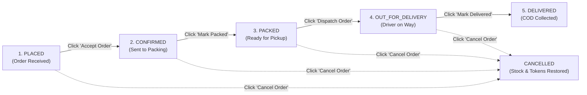

# QuickCart — Store Operations & Admin Guide

> **Single Source of Truth**: This document serves as the operational manual for store administrators and fulfillment personnel managing QuickCart operations.

---

## 1. Accessing the Admin Operations Portal

### Credentials & Security
- **URL**: `/admin/login`
- **Authentication Method**: Admin credentials verified against `ADMIN_EMAIL` and `ADMIN_PASSWORD` defined in the server environment.
- **Session Protection**: NextAuth session cookie with `role: "ADMIN"` verified on both client layouts (`app/admin/layout.tsx`) and backend API routes (`app/api/admin/*`).
- **Default Development Credentials**:
  - Email: `admin@quickcart.com`
  - Password: *(configured in `.env`)*

---

## 2. Existing Operational Workflows

### A. Operations Dashboard (`/admin`)
- **Key Metrics**: Real-time cards displaying Today's Gross Revenue, Total Order Count, Orders Pending Fulfillment, and Low-Stock Alert Count.
- **Recent Orders Queue**: Quick table showing incoming orders with direct action links to process them.
- **Inventory Warnings**: Table highlighting products where `stockQty <= lowStockThreshold`.

### B. Catalog & Product Management (`/admin/products`)
- **Product Listing**: Filterable table supporting search by product name/brand, category filter dropdown, and visibility filter (`All`, `Active`, `Hidden`, `Missing Image`).
- **Inline Visibility Toggle**: Click the Eye / Eye-Off icon in any product row to instantly toggle `isActive` status between visible and hidden on customer storefronts.
- **Live Stock Adjustments**: Adjust physical on-hand quantity directly using increment/decrement steppers without opening full edit modals.
### Creating Products (`/admin/products/new`):

- **Item Code / Barcode**: Enter the optional POS item code as text. Leading zeroes are preserved, the code must be unique, and a barcode preview is generated automatically. Leaving it blank never infers a barcode; clearing it while editing removes the stored barcode.
- **Product Images & Media Gallery**: Add up to 10 uploaded images or safe image URLs. The first image is the primary storefront/mobile image. Thumbnail controls let you set a different primary image, reorder, preview, or remove images. Existing one-image products remain compatible.
  1. Fill in required fields: Name, Category, Pack Size/Unit (e.g., `500g`, `1L`), MRP (₹), Selling Price (₹).
  2. Upload product image via Cloudflare R2 uploader (`folder: "products"`).
  3. Set initial stock quantity and low-stock alert threshold.
  4. Submit to create product record via `POST /api/admin/products`.
- **Editing Products (`/admin/products/[id]`)**: Full metadata editing, category reassignment, and symmetric Show in Store / Hide toggle.

### C. Category Hierarchy (`/admin/categories`)
- **Category Listing**: Manage store category taxonomy.
- **Visuals & Icons**: Set category display name, URL slug, category emoji, and high-resolution banner image uploaded to Cloudflare R2 (`folder: "categories"`).
- **Storefront Display Ordering**: Reorder categories via `sortOrder` integers.

### D. Order Fulfillment Lifecycle (`/admin/orders`, `/admin/orders/[orderId]`)
Store fulfillment follows a rigid 5-stage state machine:



1. **Accept Order (`PLACED` → `CONFIRMED`)**: Review customer items and address. Confirms store capacity to fulfill.
2. **Pack Order (`CONFIRMED` → `PACKED`)**: Warehouse staff picks items from shelves and packs them into delivery bags.
3. **Dispatch Order (`PACKED` → `OUT_FOR_DELIVERY`)**: Hand over delivery bag to rider.
4. **Complete Delivery (`OUT_FOR_DELIVERY` → `DELIVERED`)**: Rider delivers package and collects cash. Marking delivered automatically sets `paymentStatus` to `COLLECTED`.
5. **Cancel Order**: Available until delivered. Cancelling triggers atomic inventory restoration, coupon usage decrement, and customer token refund.

### E. Promotional Campaigns & Merchandising
- **Homepage Banners (`/admin/banners`)**: Add, toggle, and edit auto-playing homepage hero slides with custom background gradients and direct link paths.
- **Flash Deals (`/admin/flash-deals`)**: Schedule temporary discount campaigns on specific products with start and end timestamps.
- **Discount Coupons (`/admin/discounts`)**: Configure promo codes (`WELCOME20`, `QUICK50`) with minimum order requirements, percentage or flat discounts, and usage limits.
- **Chef's Choice Bundles (`/admin/bundles`)**: Multi-item bundle sets sold under a single discounted price.

### F. Store Configuration (`/admin/settings`)
- **Delivery Fee Policies**: Update standard delivery fee (default: ₹39), free delivery threshold (default: ₹399), and platform fee (default: ₹2).
- **Serviceable Pincodes**: Maintain delivery territory (default Siliguri pincodes: `734001`, `734003`, `734004`, `734005`, `734006`, `734008`).
- **Store Status**: Toggle store open/closed.

---

## 3. Operational Inventory Import & Barcode Workflows

### A. POS/ERP Bulk Spreadsheet Import Wizard (4-Step Flow)
Store inventory is synchronized directly using the daily `.xlsx` export from countertop POS terminals.

- **Source Sheet Requirements**:
  - Worksheet named `Export Items`.
  - Column Headers: `Item name*`, `Item code`, `Default M` (Default MRP), `Sale price`, `Current stock quantity`.
  - Preserves leading zeros in `Item code` (e.g. `00491823`).
  - Converts decimal rupees to exact integer paise with epsilon rounding.
  - Retains signed negative stock integers (`-1`, `-3`, `-89`) as physical dark-store shortages.

- **Operator Step-by-Step Workflow**:
  1. **Upload**: Navigate to `/admin/products` and click **Import POS Items (.xlsx)**. Drop or select the file.
  2. **Dry-Run Analysis**:
     - System calculates a SHA-256 idempotency hash and verifies whether the file was previously imported.
     - Displays comprehensive counters: **To Create**, **To Update**, **Skipped**, **Shortage Alerts**, **Missing Codes**, and **Errors**.
     - Anomaly detection flags prices exceeding MRP, promotional ₹0 samples, and intra-sheet code duplicates.
  3. **Atomic Transaction Commit**:
     - Administrator clicks **Commit Import**.
     - System executes an atomic `$transaction` batch upsert.
     - Automatically generates audit record in `InventoryImport` capturing pre-import product snapshots.
  4. **Rollback Safety Net**:
     - If an error occurred or an incorrect file was uploaded, click **Rollback Import** on the import audit record to instantly restore prior prices, stock quantities, and item codes from the stored JSON snapshot.

### B. Dark-Store Shortage Tracking
- Products with `stockQty < 0` indicate physical counter overselling or unrecorded receipt.
- Displayed with a prominent purple **Shortage (-X)** badge in the products catalog.
- Quick filter on `/admin/products` by **Shortage (Stock < 0)** allows warehouse managers to isolate items needing immediate replenishment.

### C. Barcode Printing & Order Picking Slips
- **Universal Code 128 / EAN-13 Symbology**:
  - All valid 13-digit codes with valid Modulo-10 checksum are tagged as `EAN-13`.
  - All alphanumeric (e.g. `100PB349`), 8-digit SKUs, or non-EAN codes render cleanly via universal `Code 128`.
  - Products without an item code display a manual picking indicator (barcodes are never invented from product titles).
- **Thermal Label Printing**:
  - In product edit forms (`/admin/products/[id]`), administrators can preview the live barcode SVG, download the SVG asset, or click **Print Thermal Label** formatted for standard 2" x 1" thermal label rolls.
- **Warehouse Picking Slips**:
  - On order fulfillment pages (`/admin/orders/[orderId]`), click **Print Picking Slip**.
  - Renders a clean warehouse picking slip with item barcodes, customer destination, and pick checkboxes for fast bin picking.

---

## 4. Operational Maintenance & Troubleshooting

- **Duplicate Code Conflicts**: If a row has an `Item code` that duplicates another row within the same spreadsheet, it is marked as `ERROR` and skipped during commit.
- **Blank Code Conflicts**: If a row has a blank item code but its name slug matches an existing product with a registered code, the system flags it as `CONFLICT` to prevent accidental dissociation.
- **Rollback Procedure**: Navigate to `/api/admin/inventory/import/[id]/rollback` or use the import history audit table to revert any batch import.

## 5. Database Schema Migration & Production Deployment Guide

When deploying new POS inventory import features or barcode columns to staging or production Neon PostgreSQL databases:

### ⚠️ Preflight Step: Take a Database Snapshot First
Always back up the production database before executing schema updates:
```bash
# Export compressed PostgreSQL snapshot
pg_dump "$DATABASE_URL" -Fc -f "quickcart_backup_$(date +%Y%m%d_%H%M%S).dump"
```

### Deployment Mechanism
QuickCart uses two documented, safe schema migration paths:

#### Option A: Prisma DB Push (Standard Repository Practice)
If your deployment environment uses Prisma schema synchronization without the `_prisma_migrations` table:
```bash
# Safe additive synchronization
npx prisma db push
```
> [!NOTE]
> `prisma db push` inspects the live schema against `prisma/schema.prisma`. Because the new changes (`itemCode`, `barcode`, `barcodeSymbology`, `InventoryImport`) are strictly additive with nullable fields, Prisma will confirm that no data loss will occur before applying.

#### Option B: Standalone SQL Migration Script
For enterprise change-management reviews or running inside Neon/Supabase SQL console:
```bash
# Apply additive SQL migration script directly
psql "$DATABASE_URL" -f prisma/migrations/20260921000000_add_item_code_barcode_inventory_import/migration.sql
```

#### Option C: Prisma Migrate Baseline
To initialize formal migration history tracking on an existing database:
```bash
npx prisma migrate resolve --applied 20260921000000_add_item_code_barcode_inventory_import
```

---

## 6. Barcode Lookup Architecture & Role-Based Access

Store administrators and customers interact with barcodes differently:
1. **Warehouse / Admin Lookup (`role === "ADMIN"`)**:
   - Admin view in `/admin/products` and picking slips accesses complete product records, including POS `itemCode`, internal barcodes, exact `stockQty` counts, and physical dark-store shortages.
2. **Storefront Mobile Scanner (`role === "CUSTOMER"`)**:
   - Mobile barcode scanning via `/scanner` is authenticated.
   - Customers receive sanitized storefront fields only (`id`, `name`, `slug`, `price`, `mrp`, `image`, `unit`, `availability`).
   - Warehouse shortages, physical inventory quantities, and internal item codes are strictly filtered out to prevent leaking commercial or operational data.

---

## 7. Current Implementation vs. Planned Implementation vs. Known Limitations

### Current Implementation
- Full admin dashboard, product catalog management, category CRUD, banner management, order fulfillment state machine, and settings configuration are live in the web application.
- Cloudflare R2 image upload pipeline is integrated into product, category, and banner forms.
- Production-grade POS bulk inventory import (`Export Items` sheet) with 4-step wizard, dry-run counters, shortage alerts, and snapshot rollback.
- Live Code 128 / EAN-13 barcode SVG preview, thermal label printing (2" x 1"), and order picking slip generator.

### Planned Implementation
- Hardware USB barcode scanner rapid-fire wedge input mode in admin order fulfillment.
- Exportable CSV/PDF daily settlement reports for COD collections.

### Known Limitations
- **No Multi-Tier Role Hierarchy**: All administrators currently share a single `ADMIN` role with unrestricted access to settings and inventory data.
- **Manual Stock Audit Trail**: While bulk imports record complete pre-import snapshots in `InventoryImport`, single-product manual stepper clicks on `/admin/products` update quantity directly without logging reason codes.

---

## 6. Documentation Maintenance Rule

> [!IMPORTANT]
> **Documentation Maintenance Rule**:
> Any modification to admin workflows, fulfillment steps, modal interfaces, or operational settings must be documented in this file and logged in `docs/CHANGELOG.md` in the same pull request.
