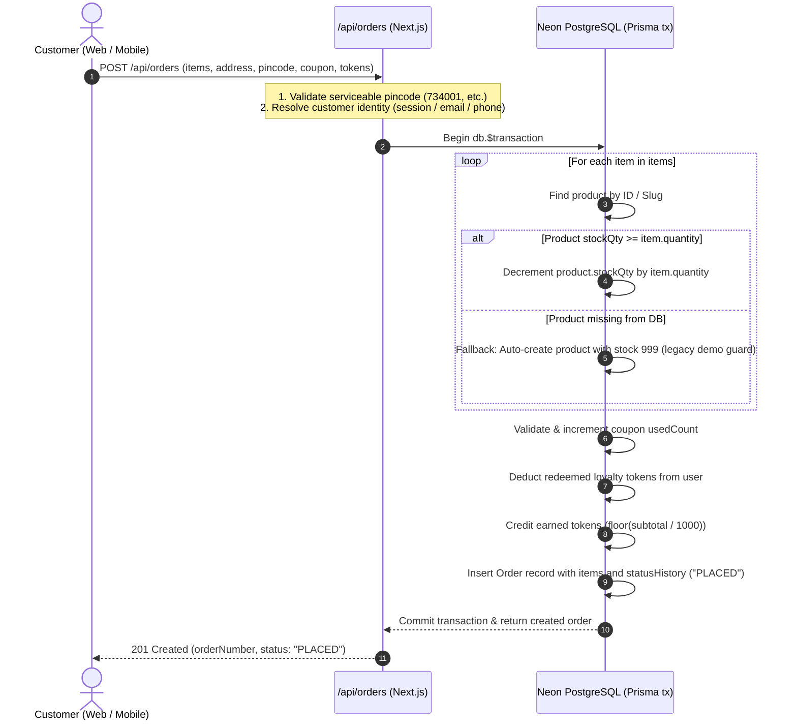
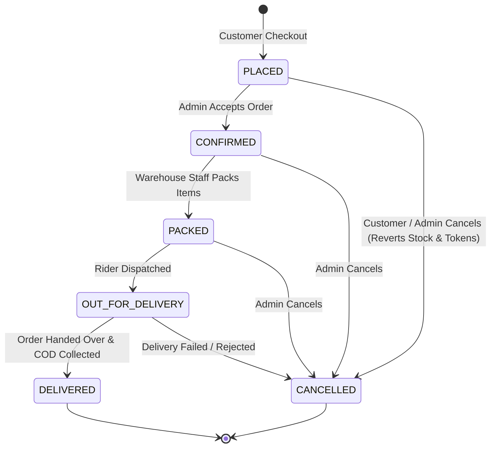
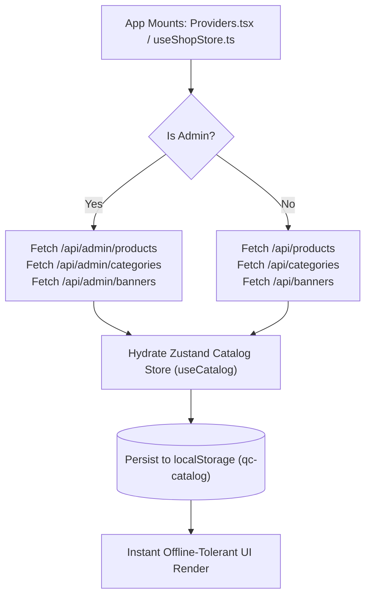

# QuickCart — System Architecture & Technical Blueprint

> **Single Source of Truth**: This document details the end-to-end technical architecture, route mappings, data flows, state synchronization mechanisms, and deployment surfaces of the QuickCart monorepo.

---

## 1. System Topology

```mermaid
flowchart TB
    subgraph Client Surfaces
        WebClient["Next.js Web Client (React 19)<br/>Storefront & Admin Portal"]
        MobileClient["Expo Mobile Client (React Native 0.81)<br/>Android (com.semart.app) & iOS"]
    end

    subgraph Edge & Ingestion Layer
        VercelEdge["Vercel Edge / Serverless Ingress<br/>(quickcart-nu-nine.vercel.app)"]
        CF_CDN["Cloudflare Global Edge CDN<br/>(*.r2.dev)"]
    end

    subgraph Application & API Layer (Next.js App Router)
        NextAuth["NextAuth.js v5<br/>(JWT Sessions)"]
        PublicAPI["Public Catalog & Config API<br/>(/api/products, /api/categories, etc.)"]
        AuthAPI["Mobile & Custom Auth API<br/>(/api/auth/google-native, /api/auth/truecaller)"]
        OrderAPI["Order & Payment API<br/>(/api/orders, /api/orders/[id]/cancel)"]
        AdminAPI["Protected Admin Operations API<br/>(/api/admin/*)"]
    end

    subgraph Data & Storage Services
        NeonDB[("Neon Serverless PostgreSQL<br/>(Prisma ORM 6.19)")]
        R2Store[("Cloudflare R2 Object Storage<br/>Bucket: groceryitems")]
        GmailSMTP["Nodemailer SMTP<br/>(smtp.gmail.com:465)"]
    end

    WebClient -->|HTTPS / NextAuth Cookies| VercelEdge
    MobileClient -->|HTTPS / JSON REST API| VercelEdge
    VercelEdge --> NextAuth
    VercelEdge --> PublicAPI
    VercelEdge --> AuthAPI
    VercelEdge --> OrderAPI
    VercelEdge --> AdminAPI

    PublicAPI --> NeonDB
    AuthAPI --> NeonDB
    AuthAPI --> GmailSMTP
    OrderAPI --> NeonDB
    AdminAPI --> NeonDB
    AdminAPI -->|S3 SigV4 PutObject| R2Store
    R2Store --> CF_CDN
    CF_CDN -->|Cached Images| WebClient
    CF_CDN -->|Cached Images| MobileClient
```

---

## 2. Route Map

### A. Web Application Routes (`app/`)

| Path | Access Control | Purpose |
| :--- | :--- | :--- |
| `/` | Public | Storefront home: hero banner carousel, category chips, flash deals, featured products. |
| `/categories` | Public | Full catalog category sidebar and browsing grid. |
| `/category/[slug]` | Public | Products listed under a specific category with sorting and stock filters. |
| `/product/[slug]` | Public | Product details page with image preview, unit details, pricing, related items. |
| `/search` | Public | Keyword search across product name, brand, tags, and category. |
| `/cart` | Public | Shopping cart review, quantity increments, live bill summary. |
| `/checkout` | Authenticated / Guest | Address selection, pincode validation, order summary, Cash on Delivery submission. |
| `/orders` | Authenticated | Order history listing with status badges. |
| `/orders/[orderId]` | Authenticated | Real-time order delivery timeline, item breakdown, and self-cancel action. |
| `/login` | Public | Web sign-in portal supporting Google OAuth and Email OTP. |
| `/verify` | Public | 6-digit Email OTP entry screen. |
| `/account` | Authenticated | Customer profile management. |
| `/account/addresses` | Authenticated | Address book list (add, edit, delete, set default). |
| `/admin/login` | Public | Separate admin credential login screen. |
| `/admin` | Admin (`role: ADMIN`) | Operations dashboard: today's revenue, order counts, low-stock warnings. |
| `/admin/products` | Admin (`role: ADMIN`) | Product table, stock adjustments, show/hide toggle, Excel import modal trigger. |
| `/admin/products/new` | Admin (`role: ADMIN`) | New product form with Cloudflare R2 image uploader. |
| `/admin/products/[id]` | Admin (`role: ADMIN`) | Edit existing product details, stock, pricing, and visibility. |
| `/admin/categories` | Admin (`role: ADMIN`) | Category CRUD with R2 image uploader and sort orders. |
| `/admin/orders` | Admin (`role: ADMIN`) | Order fulfillment table with status filtering. |
| `/admin/orders/[orderId]` | Admin (`role: ADMIN`) | Detailed order fulfillment view: state machine status transitions, payment tracking. |
| `/admin/banners` | Admin (`role: ADMIN`) | Promotional banner management with image upload and link configurations. |
| `/admin/flash-deals` | Admin (`role: ADMIN`) | Time-bounded flash discount campaign scheduler. |
| `/admin/discounts` | Admin (`role: ADMIN`) | Coupon code generator (percentage / flat discount, min order value). |
| `/admin/bundles` | Admin (`role: ADMIN`) | Curated bundle builder ("Chef's Choice" packs). |
| `/admin/settings` | Admin (`role: ADMIN`) | Delivery fees, free delivery threshold, platform fee, serviceable pincodes, demo reset. |

### B. Mobile Application Screens (`Mobile-app/app/`)

| Screen File | Route Path | Purpose |
| :--- | :--- | :--- |
| `app/(tabs)/index.tsx` | `/(tabs)` | Mobile storefront home: banners, category grid, quick-order sections. |
| `app/(tabs)/categories.tsx` | `/(tabs)/categories` | Category selector and product listings. |
| `app/(tabs)/cart.tsx` | `/(tabs)/cart` | Persistent cart screen with bill breakdown (₹2 platform fee). |
| `app/(tabs)/orders.tsx` | `/(tabs)/orders` | Customer order history list. |
| `app/(tabs)/profile.tsx` | `/(tabs)/profile` | Profile details, address management, token balance, logout. |
| `app/checkout.tsx` | `/checkout` | Mobile checkout flow, address confirmation, COD placement. |
| `app/order-details/[id].tsx` | `/order-details/[id]` | Live order tracking timeline and server-backed cancellation. |
| `app/search.tsx` | `/search` | Full-screen product search with instant debounced filtering and scanner launcher. |
| `app/scanner.tsx` | `/scanner` | Native Expo CameraView barcode scanner with reticle viewfinder and read-only product lookup. |
| `app/category/[slug].tsx` | `/category/[slug]` | Dedicated category products view. |
| `app/product/[slug].tsx` | `/product/[slug]` | Product details screen. |
| `app/login.tsx` | `/login` | Native Google Sign-In, Truecaller One-Tap, and Email OTP triggers. |
| `app/verify.tsx` | `/verify` | OTP verification screen. |

---

## 3. REST API Endpoint Registry

```
/api
├── /config (GET) — Public store fees and default settings
├── /categories (GET) — Active public categories
├── /banners (GET) — Active homepage banners
├── /flash-deals (GET) — Active timed deals
├── /bundles (GET) — Curated multi-item packs
├── /products (GET) — Catalog search, category filter, in-stock filter
├── /products/[slug] (GET) — Single product details & recommendations
├── /products/barcode/[code] (GET) — Read-only barcode & itemCode resolution endpoint
├── /coupons/validate (POST) — Coupon code validity & discount calculation
├── /orders (GET, POST) — User order list / Atomic order placement with strict concurrency reservation
├── /orders/[id] (GET) — Single order detail with status history
├── /orders/[id]/cancel (POST) — Hardened cancellation, guest verification, and inventory/token rollback
├── /user
│   ├── /addresses (GET, POST, PUT, DELETE) — Customer address book
│   └── /tokens (GET) — Customer loyalty coin balance
├── /auth
│   ├── /[...nextauth] — NextAuth v5 session endpoints
│   ├── /send-otp (POST) — Nodemailer 6-digit OTP dispatch
│   ├── /verify-otp (POST) — OTP verification and user provisioning
│   ├── /google-native (POST) — Verification of Google ID Token from Expo mobile
│   └── /truecaller (POST) — Truecaller PKCE token exchange & profile resolution
└── /admin (All endpoints require role === "ADMIN")
    ├── /dashboard (GET) — Sales metrics, pending count, low-stock & shortage alerts
    ├── /products (GET, POST, PUT, DELETE) — Full catalog administration with barcode preview & shortage filters
    ├── /products/bulk (POST) — Atomic batch upsert for Excel imports
    ├── /inventory/import
    │   ├── /preview (POST) — 10MB dry-run POS parser, SHA-256 idempotency check, and anomaly metrics
    │   ├── /commit (POST) — Atomic transactional bulk upsert with product rollback snapshots
    │   └── /[id]/rollback (POST) — Reverts prices, stock, and itemCodes to pre-import snapshot state
    ├── /categories (GET, POST, PUT, DELETE) — Category hierarchy management
    ├── /banners (GET, POST, PUT, DELETE) — Promotional banner CRUD
    ├── /orders (GET) — Storewide order fulfillment list
    ├── /orders/[id]/status (PATCH) — Order fulfillment transition with full cancellation token/coupon parity
    ├── /config (GET, PUT) — Store fee policies & serviceable pincodes
    ├── /coupons (GET, POST, PUT, DELETE) — Promotion code management
    ├── /flash-deals (GET, POST, PUT, DELETE) — Flash deal campaigns
    ├── /bundles (GET, POST, PUT, DELETE) — Bundle packs management
    └── /upload (POST) — Cloudflare R2 authenticated S3 image upload
```

---

## 4. End-to-End Data Flows

### A. Order Placement & Atomic Stock Decrement



### B. Order Status Fulfillment State Machine



### C. Client-Side State Synchronization (Hydration Engine)



---

## 5. Deployment Surfaces & Infrastructure

| Layer | Technology | Hosting Provider | Configuration & Variables |
| :--- | :--- | :--- | :--- |
| **Web & API** | Next.js 15.1 Serverless App Router | **Vercel** | `DATABASE_URL`, `NEXTAUTH_SECRET`, `GOOGLE_CLIENT_ID`, `APP_EMAIL`, `APP_PASSWORD`, `CLOUDFLARE_R2_*` |
| **Mobile App** | React Native 0.81 / Expo SDK 54 | **Google Play Console / Standalone APK** | Built via GitHub Actions (`build-apk.yml`). Configured via `Mobile-app/app.json` (`com.semart.app`). |
| **Database** | PostgreSQL 16 Serverless | **Neon** | Managed pooling connection via `DATABASE_URL?sslmode=require`. Schema migrations managed with Prisma CLI. |
| **Object Storage & CDN** | S3-Compatible Object Store | **Cloudflare R2** | Bucket `groceryitems`, Account `c7d624ee1a82d294c62275a2135719b4`, served via global Cloudflare Edge cache. |
| **Email Transporter** | SMTP | **Gmail App Password** | Sent via port 465 SSL using `APP_EMAIL` and `APP_PASSWORD`. |

---

## 6. Current Implementation vs. Planned Implementation vs. Known Limitations

### Current Implementation
- App Router API routes act as the single backend for both Web and Expo Mobile.
- Dual-auth parity: NextAuth v5 session for web; custom verified endpoints (`/api/auth/google-native`, `/api/auth/truecaller`) for mobile.
- Store catalog and user cart persist locally in Zustand and re-synchronize upon network availability.

### Planned Implementation
- True centralized API authentication using unified Bearer JWTs across both Web and Mobile instead of splitting NextAuth cookies and custom endpoint bodies.
- Redis-based caching layer (Upstash / Redis) for high-frequency catalog reads.
- Automated database migration pipelines in CI/CD before deploying Vercel functions.

### Known Limitations
- **Hybrid State Conflict**: If `Providers.tsx` fails to fetch from `/api/*`, the web app silently falls back to localStorage or hardcoded mock data in `lib/data.ts`.
- **Serverless In-Memory Rate Limiting**: The rate limiter in `lib/rateLimit.ts` cannot enforce global limits across distributed Vercel serverless instances.
- **Unverified Mobile Origin**: Mobile endpoints rely on client-supplied body payloads (`email`, `phone`) without signed request verification in some non-OAuth endpoints.

---

## 7. Documentation Maintenance Rule

> [!IMPORTANT]
> **Documentation Maintenance Rule**:
> Any architectural change (adding new routes, altering API payload contracts, introducing third-party services, modifying deployment configurations) must update this document and be recorded in `docs/CHANGELOG.md` in the same pull request.
