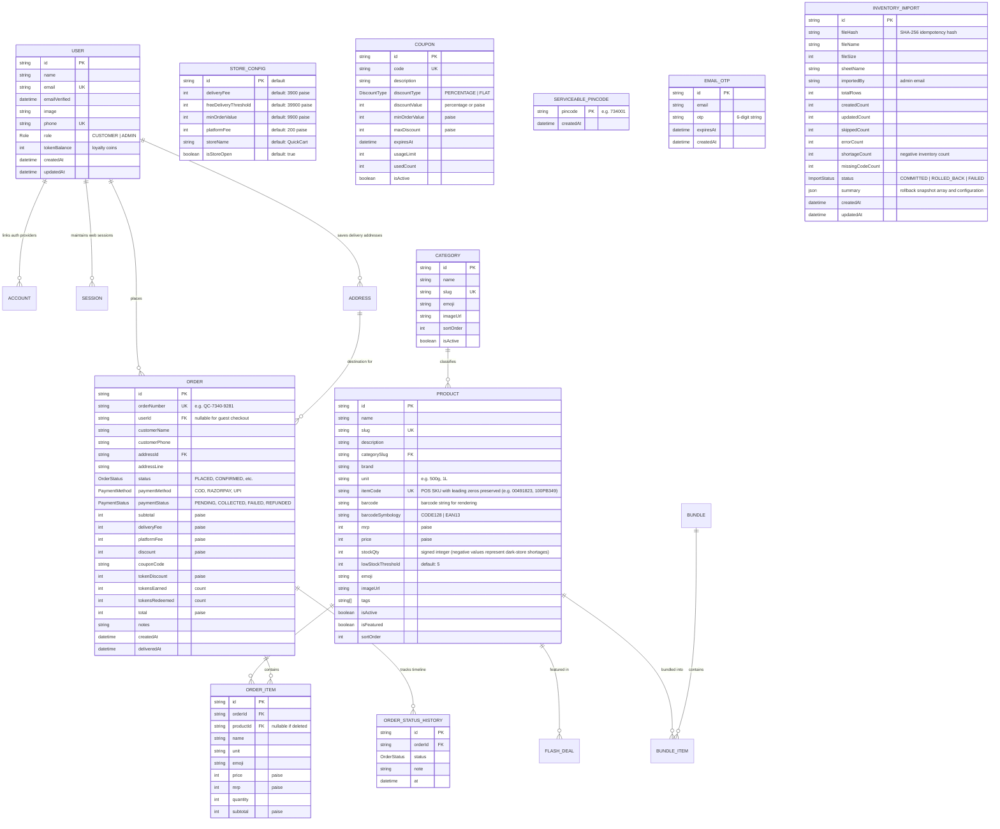

# QuickCart — Data Model & Inventory Semantics

> **Single Source of Truth**: This document details the database entity relationship model, Prisma schemas, financial calculation units, inventory lifecycle, and known domain gaps.

---

## 1. Entity-Relationship Model (Prisma ORM)



---

## 2. Enums Definition

| Enum Name | Allowed Values | Semantic Meaning |
| :--- | :--- | :--- |
| `Role` | `CUSTOMER`, `ADMIN` | User privilege boundary. `ADMIN` has full access to `/admin` and `/api/admin/*`. |
| `OrderStatus` | `PLACED`, `CONFIRMED`, `PACKED`, `OUT_FOR_DELIVERY`, `DELIVERED`, `CANCELLED` | Order fulfillment lifecycle state machine. |
| `PaymentStatus` | `PENDING`, `COLLECTED`, `FAILED`, `REFUNDED` | Monetary collection status. Advances to `COLLECTED` upon COD delivery; `REFUNDED` on cancellation. |
| `PaymentMethod` | `COD`, `RAZORPAY`, `UPI` | Payment instrument. Currently `COD` is active in storefront operations. |
| `DiscountType` | `PERCENTAGE`, `FLAT` | Promotion discount computation type. |
| `ImportStatus` | `COMMITTED`, `ROLLED_BACK`, `FAILED` | Inventory bulk import audit log state machine. |
| `SymbologyType` | `CODE128`, `EAN13` | Universal barcode symbology resolver type. |

---

## 3. Financial Units & Money Semantics

### Standard Monetary Representation
> [!IMPORTANT]
> **Paise Unit Rule**: All monetary values in the database, API payloads, Zustand stores, and calculation pipelines are strictly stored and computed as **integers in Indian Paise** (1 Rupee = 100 Paise).
> - Example: ₹39.00 Delivery Fee = `3900`
> - Example: ₹399.00 Free Delivery Threshold = `39900`
> - Example: ₹2.00 Platform Fee = `200`
> - Example: ₹72.36 Item Price = `7236`

### Price Calculation Formula
$$\text{Total} = \max(0, \text{Subtotal} + \text{DeliveryFee} + \text{PlatformFee} - \text{CouponDiscount} - \text{TokenDiscount})$$

Where:
- **Subtotal**: $\sum (\text{item.price} \times \text{item.quantity})$
- **DeliveryFee**: If $\text{Subtotal} \ge \text{StoreConfig.freeDeliveryThreshold}$, then `0`; else `StoreConfig.deliveryFee` (`3900` paise).
- **PlatformFee**: Fixed `200` paise (₹2).
- **Token Discount**: Loyalty tokens redeemed in blocks of 100. Every 100 tokens = ₹25 (`2500` paise).
- **Tokens Earned**: 1 token per ₹10 spent on subtotal: $\lfloor \text{Subtotal} / 1000 \rfloor$.
- **Lower Bound**: The total is wrapped with `Math.max(0, ...)` to ensure an order total can never be negative.

---

## 4. Stock & Inventory Semantics

### Physical Retail vs. Digital Stock Semantics
In grocery retail operations (and specifically in the POS/ERP Excel exports), stock levels represent physical dark-store counts:
1. **Positive Stock (`stockQty > 0`)**: Available physical inventory for picking.
2. **Zero Stock (`stockQty == 0`)**: Item is out of stock. Storefronts display "Out of Stock" badges and disable increment buttons.
3. **Negative Stock (`stockQty < 0`, e.g. `-1`, `-3`, `-89`)**: **Valid physical retail shortage / oversold state**. This occurs when items are physically sold at the counter before being entered into the ERP, or damaged/written off.
   > [!CAUTION]
   > **Never Coerce Negatives to Zero**: Bulk import parsers must **preserve signed negative stock values**. Coercing negative stock to zero masks physical shortages and corrupts inventory audits.

### Order Placement Inventory Decrement
When an order is created via `POST /api/orders`:
```typescript
if (product.stockQty >= item.quantity) {
  await tx.product.update({
    where: { id: product.id },
    data: { stockQty: { decrement: item.quantity } },
  });
}
```
*Current Implementation Note*: If `product.stockQty < item.quantity`, the current code does not decrement stock and does not throw an error (allowing overselling). A stricter transactional check is planned for production hardening.

### Order Cancellation Rollback
When an order is cancelled via `POST /api/orders/[id]/cancel`:
1. **Inventory**: Restores stock for all order items:
   `stockQty: { increment: item.quantity }`
2. **Loyalty Tokens Refund**: If `tokensRedeemed > 0`, tokens are refunded to the customer account.
3. **Earned Tokens Clawback**: If `tokensEarned > 0`, earned tokens from the order are deducted:
   `newBalance = Math.max(0, currentBalance - tokensEarned)`
4. **Coupon Usage**: Decrements `coupon.usedCount` if a coupon was used.
5. **Payment Status**: Updated to `REFUNDED` if previously `COLLECTED`.

---

## Product media and barcode fields

`Product.itemCode` is an optional unique POS identifier. When present, the admin product API stores the same normalized value in `barcode` and resolves its symbology; clearing the code clears all barcode fields. `Product.imageUrls` is the additive multi-image gallery field. Its first entry is the primary image and is synchronized to the legacy `imageUrl` field so existing cards, carts, and mobile list consumers remain compatible. Existing records with only `imageUrl` are treated as a one-image gallery.

## 5. Database Schema Migration & Deployment Procedures

### Additive Migration Artifact
The schema evolution adding POS `itemCode`, `barcode`, `barcodeSymbology`, and the `InventoryImport` audit model is packaged as a reviewable additive SQL script at:
[`prisma/migrations/20260921000000_add_item_code_barcode_inventory_import/migration.sql`](file:///home/amann/Freelance/anishDa/quickcart/prisma/migrations/20260921000000_add_item_code_barcode_inventory_import/migration.sql)

### Safe Production Deployment Steps
1. **Preflight Backup**:
   The store owner/DBA must create a point-in-time backup before updating the database:
   ```bash
   pg_dump "$DATABASE_URL" -Fc -f "quickcart_backup_$(date +%Y%m%d_%H%M%S).dump"
   ```
2. **Schema Update Options**:
   - **Option 1 (`npx prisma db push`)**: The repository's standard mechanism for environments operating without the `_prisma_migrations` table. Because all new columns are nullable and the new table is standalone, `prisma db push` runs without risk of data loss.
   - **Option 2 (Direct SQL Execution)**:
     ```bash
     psql "$DATABASE_URL" -f prisma/migrations/20260921000000_add_item_code_barcode_inventory_import/migration.sql
     ```
   - **Option 3 (Baseline Migration)**:
     ```bash
     npx prisma migrate resolve --applied 20260921000000_add_item_code_barcode_inventory_import
     ```

---

## 6. Current Implementation vs. Planned Implementation vs. Known Limitations

### Current Implementation
- Strict integer paise representations across all tables (`Product`, `Order`, `OrderItem`, `StoreConfig`, `Coupon`).
- Category foreign key relationship on `Product.categorySlug`.
- Enhanced `Product` model with `itemCode String? @unique`, `barcode String?`, and `barcodeSymbology String?`.
- Audit log model `InventoryImport` capturing SHA-256 idempotency hash, file metrics, and pre-import JSON snapshots.
- Atomic concurrency guard in `POST /api/orders` rejecting orders when `stockQty < requestedQty`.
- Role-based barcode endpoint (`GET /api/products/barcode/[code]`): Sanitized storefront view for customers vs rich warehouse view for admins.

### Planned Implementation (Schema Evolution)
- **Strict Stock Reservation**: Lock rows using `SELECT ... FOR UPDATE` during checkout to prevent race conditions on the last inventory units.
- **Inventory Audit Log**: Introduce a `StockMovement` table tracking reasons for stock adjustments (`IMPORT`, `SALE`, `CANCEL_RESTOCK`, `DAMAGE_WRITE_OFF`, `MANUAL_ADJUSTMENT`).

### Known Limitations
- **In-Memory Rate Limiting**: In-memory rate limiting map in `lib/rateLimit.ts` is isolate-local on Vercel and resets on cold starts. Upstash Redis is planned for distributed rate limiting.
- **Single-Item Manual Stock Audits**: Manual stock adjustments on `/admin/products` update counts immediately without storing reason codes in an audit log.

---

## 7. Documentation Maintenance Rule

> [!IMPORTANT]
> **Documentation Maintenance Rule**:
> Any database migration, field addition, unit change, or inventory transaction logic adjustment must update this document and be recorded in `docs/CHANGELOG.md` in the same pull request.
