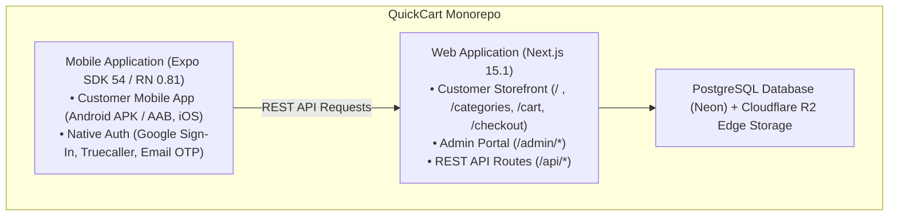

# QuickCart — Project Overview

> **Single Source of Truth**: This document outlines the business context, target audience, application boundaries, and operational status of the QuickCart platform.

---

## 1. Product Purpose & Value Proposition

**QuickCart** is a full-stack quick-commerce grocery application designed for ultra-fast local delivery (inspired by platforms like Zepto, Blinkit, and Instamart). The platform provides:
- **Instant Product Discovery**: Sub-second catalog browsing, fuzzy keyword search, category filtering, and promotional flash deals.
- **Localized Delivery Operations**: Strict serviceable pincode gating focused initially on the Siliguri urban market (West Bengal, India), with dynamic delivery fees and free delivery threshold incentives.
- **Omnichannel Shopping**: Seamless consumer shopping across a responsive web application (Next.js) and a native mobile application (React Native / Expo for Android and iOS).
- **Centralized Operations Hub**: A web-based admin operations portal allowing store managers to manage inventory, fulfill customer orders via an explicit status state machine, launch marketing banners, and configure delivery parameters.

---

## 2. Target User Personas

| Persona | Primary Interface | Key Capabilities & Objectives |
| :--- | :--- | :--- |
| **Retail Consumer** | Next.js Web Storefront (`/`) & Expo Mobile App (`com.semart.app`) | Browse fresh grocery products, add to cart, apply coupon codes, redeem loyalty tokens, choose delivery address, select payment (Cash on Delivery), and monitor order delivery progress in real time. |
| **Store Manager / Admin** | Web Admin Portal (`/admin`) | Monitor today's sales & order volumes, receive low-stock alerts, manage product pricing/stock, toggle item visibility, advance order fulfillment stages, create discount coupons, and manage serviceable pincodes. |
| **Fulfillment / Delivery Staff** | Admin Portal (`/admin/orders`) *(Planned: dedicated delivery app)* | Pick and pack ordered items, verify address details, move order to `OUT_FOR_DELIVERY`, collect cash on delivery, and mark orders `DELIVERED`. |

---

## 3. Surface & Scope Breakdown

### A. Customer Web Storefront (`app/(shop)/*`, `app/cart`, `app/checkout`, `app/orders`)
- **Framework**: Next.js 15.1 App Router, React 19, Tailwind CSS v3.
- **Capabilities**: Responsive mobile-first layout, banner carousel, category grid, live search, cart slider/page, checkout with address validation, order tracking timeline.

### B. Customer Mobile Application (`Mobile-app/`)
- **Framework**: Expo SDK ~54.0.37, React Native 0.81.5, Expo Router v6.
- **Package Identity**: `com.semart.app` (internal project name *Semart* / *QuickCart*), Android Version Code 4.
- **Capabilities**: Tab navigation (Home, Categories, Cart, Orders, Profile), Native Google Sign-In, Truecaller One-Tap authentication, Email OTP, live order tracking, customer self-cancellation.

### C. Admin Operations Portal (`app/admin/*`)
- **Access**: Role-gated web dashboard (`role === "ADMIN"`).
- **Capabilities**: Dashboard analytics, product CRUD with Cloudflare R2 image pipeline, category hierarchy, order state machine, homepage banner management, flash deal scheduling, discount coupons, and store settings.

### D. Central API & Backend Engine (`app/api/*`)
- **Hosting**: Next.js Serverless Route Handlers deployed on Vercel.
- **Data Access**: Prisma ORM v6.19 talking to a serverless Neon PostgreSQL database.

---

## 4. Current Implementation vs. Planned Implementation vs. Known Limitations

### Current Implementation
- **Catalog Browsing**: Functional on both Web and Mobile. Categories, products, and banners are hydrated from the database via REST endpoints (`/api/categories`, `/api/products`, `/api/banners`).
- **Cart & Pricing Engine**: Local state calculation in integer paise (₹1 = 100 paise), delivery fee calculation, platform fee (₹2), and free delivery threshold evaluation.
- **Order Placement**: Atomic transactional order creation in PostgreSQL (`/api/orders`), deducting inventory when in-stock conditions are met.
- **Order Fulfillment Workflow**: Admin status transitions (`PLACED` → `CONFIRMED` → `PACKED` → `OUT_FOR_DELIVERY` → `DELIVERED` / `CANCELLED`).
- **Image Pipeline**: Cloudflare R2 upload route (`/api/admin/upload`) using AWS S3 SDK with 1-year immutable edge CDN cache headers, with local filesystem fallback for development.
- **Authentication**:
  - Web: NextAuth v5 supporting Google OAuth and Email OTP (via Nodemailer SMTP).
  - Mobile: Native Google Sign-In, Truecaller SDK (client ID `vehpunfwibqmwezricdesqmr9eet09qgwrnyzekapgi`), and Email OTP with phone-email account linking.
- **Deployment**: Next.js web application deployed to Vercel (`https://quickcart-nu-nine.vercel.app`); Android APK and Play Store AAB built via GitHub Actions (`.github/workflows/build-apk.yml`).

### Planned Implementation
- **Excel Bulk Inventory Import**: Dedicated parser for POS/ERP export spreadsheets (`Export Items` sheet) with signed inventory handling, code preservation, and dry-run validation.
- **Barcode Workflow**: Generation and camera scanning of barcodes during fulfillment/packing based strictly on existing `itemCode` values.
- **Live Payment Gateways**: Online payment processing via Razorpay / UPI intent flows (currently enum placeholders; orders default to Cash on Delivery).
- **Real-Time WebSockets**: Live delivery driver location tracking and instant order status push updates.
- **Dedicated Delivery Agent App**: Separate mobile surface for dispatch riders to accept delivery assignments and capture delivery proof.

### Known Limitations
- **Zero Automated Tests**: The repository currently lacks unit tests, API integration tests, and end-to-end browser/mobile suites.
- **In-Memory Rate Limiting**: The rate limiter (`lib/rateLimit.ts`) uses an in-memory JavaScript `Map`. In a multi-instance or serverless Vercel environment, rate limit state is not shared between lambda invocations.
- **Schema Gaps for Retail Operations**: The current Prisma schema lacks an `itemCode` or `barcode` field on the `Product` entity.
- **Guest Order Cancellation Vulnerability**: In `POST /api/orders/[id]/cancel`, orders placed without a linked user ID (`userId == null`) lack robust ownership verification if query parameters are omitted.
- **Dynamic Product Creation on Order Placement**: If a customer checks out an item missing from the database, `POST /api/orders` dynamically creates the product with stock `999` to prevent database FK failure, which can introduce unverified items into the catalog.

---

## 5. Documentation Maintenance Rule

> [!IMPORTANT]
> **Documentation Maintenance Rule**:
> Any pull request or commit that modifies product features, data models, API endpoints, environment variables, or workflows MUST update the corresponding documentation files under `docs/` and log the change in `docs/CHANGELOG.md` within the same pull request. Unreviewed documentation drift is treated as a blocking build failure.
