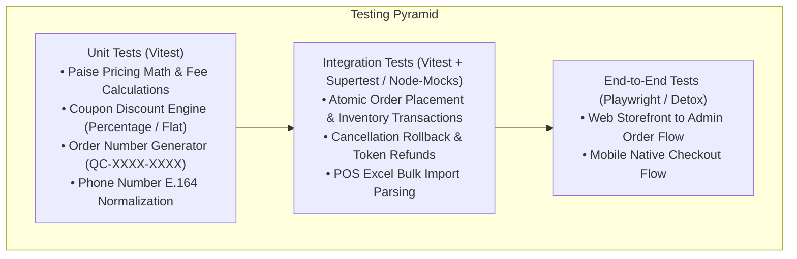

# QuickCart — Quality Assurance & Testing Strategy

> **Single Source of Truth**: This document details verification commands, current testing posture, test automation strategies, and manual quality assurance protocols across the QuickCart monorepo.

---

## 1. Current Testing Posture: Reality & Baseline

> [!WARNING]
> **Zero Automated Tests**: The QuickCart monorepo currently has **no automated unit tests, integration test suites, or E2E browser tests** configured in either the root web project or the `Mobile-app` directory.
> Quality assurance currently relies on TypeScript static type checking, ESLint rules, Next.js build compilation, and manual verification protocols.

---

## 2. Verification Commands & Build Gates

All changes must pass these automated verification commands prior to staging or production deployment:

### A. Web Application & API Verification
```bash
# 1. TypeScript Static Analysis (Root)
npx tsc --noEmit

# 2. Next.js ESLint Verification
npm run lint

# 3. Prisma Schema Validation
npx prisma validate

# 4. Production Build Compilation (Generates Prisma Client & builds App Router)
npm run build
```

### B. Mobile Application Verification (`Mobile-app/`)
```bash
cd Mobile-app

# 1. TypeScript Static Analysis (Mobile)
npm run lint    # Alias for tsc --noEmit

# 2. Expo Configuration Diagnostics
npx expo doctor

# 3. Validate Metro Bundling (Without starting interactive UI)
npx expo export --platform android --dump-sourcemap
```

---

## 3. Comprehensive Testing Roadmap & Strategy



### Tier 1: Unit Test Targets (Planned Vitest Suite)
1. **Financial Calculations (`lib/format.ts`, `lib/coupon.ts`)**:
   - Verify integer paise precision: ₹72.36 converts to `7236` paise.
   - Verify platform fee addition (₹2 = `200` paise).
   - Test coupon discount caps (e.g. 20% discount capped at max ₹100).
   - Test minimum order threshold validation.
   - Test `Math.max(0, ...)` total floor preventing negative charges.
2. **Order Number Generation (`lib/orderNumber.ts`)**:
   - Verify pattern matching: `QC-XXXX-XXXX` with correct uppercase alphanumeric segments.
3. **Excel Import Validation Engine (`components/admin/ImportProductsModal.tsx`)**:
   - Verify preservation of leading zeros on string item codes (`00491` does not become `491`).
   - Verify preservation of signed negative stock values (`-1`, `-3`, `-89`).
   - Verify handling of truncated header `Default M` as Default MRP.

### Tier 2: Integration Test Targets
1. **Atomic Order Placement (`POST /api/orders`)**:
   - Verify that placing an order with 2 units of an item decrements `stockQty` by 2 in a transaction.
   - Verify rejection of delivery addresses outside serviceable Siliguri pincodes.
   - Verify that invalid coupons return 400 without creating order records.
2. **Atomic Cancellation Rollback (`POST /api/orders/[id]/cancel`)**:
   - Verify product inventory is restored (`increment: quantity`).
   - Verify redeemed loyalty tokens are re-credited to customer account.
   - Verify earned loyalty tokens are deducted from customer balance.
   - Verify coupon `usedCount` is decremented.

### Tier 3: End-to-End (E2E) Test Targets
- **Web Storefront E2E (Playwright)**:
  1. Add product to cart.
  2. Navigate to `/cart` and check bill summary.
  3. Proceed to `/checkout`, select Siliguri address (`734001`).
  4. Submit Cash on Delivery order.
  5. Open `/admin/orders`, locate order, advance status: `PLACED` → `CONFIRMED` → `PACKED` → `OUT_FOR_DELIVERY` → `DELIVERED`.
  6. Return to customer order tracking page and confirm status updates to `DELIVERED` and payment to `COLLECTED`.
- **Mobile E2E (Detox / Maestro)**:
  1. Launch mobile app (`com.semart.app`).
  2. Perform Google Sign-In or OTP login.
  3. Add item to cart and verify ₹2 platform fee on `BillSummary`.
  4. Place order and trigger self-cancellation while status is `PLACED`.

---

## 4. Manual Quality Assurance (QA) Checklist

### Web Storefront Checklist
- [ ] **Home Page**: Hero banner carousel auto-advances; clicking banner navigates to correct category/filter.
- [ ] **Category Navigation**: `/categories` sticky sidebar aligns below top bar without header overlap (`top-16`).
- [ ] **Search**: Searching for partial keyword (e.g. `mil`) returns relevant matching dairy items.
- [ ] **Cart Operations**: Incrementing and decrementing quantities recalculates subtotal and threshold bar dynamically.
- [ ] **Checkout Gating**: Unserviceable pincodes (e.g. `110001` Delhi) trigger an error banner; Siliguri pincodes (`734001`) allow submission.

### Mobile App Checklist
- [ ] **Login Screen**: All auth buttons (Google, Truecaller, Email OTP) render without layout cutoffs across different screen heights.
- [ ] **Cart & Bill Summary**: Platform fee displays as ₹2 (matching web storefront).
- [ ] **Cancellation Flow**: Clicking "Cancel Order" displays an `ActivityIndicator` spinner, calls the server API, updates the order badge to `CANCELLED`, and refreshes the loyalty coin balance.
- [ ] **Logout Flow**: Logging out uses `router.replace("/login")` to ensure Android hardware back button cannot return to authenticated profile.

### Admin Portal Checklist
- [ ] **Admin Auth Gate**: Accessing `/admin` while unauthenticated redirects to `/admin/login`.
- [ ] **Image Upload**: Uploading product image to Cloudflare R2 displays live image preview with `r2.dev` URL.
- [ ] **Product Visibility**: Clicking eye icon toggles product visibility on customer storefronts immediately.
- [ ] **Order Status Advancement**: Moving order through stages updates timestamp history in database.

---

## 5. Documentation Maintenance Rule

> [!IMPORTANT]
> **Documentation Maintenance Rule**:
> When automated testing frameworks (Vitest, Playwright, Maestro) are introduced or verification commands change, this document and `docs/CHANGELOG.md` must be updated within the same pull request.
